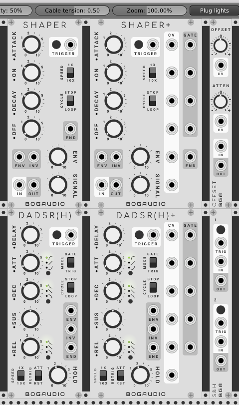

# BogaudioModules
Modules for [VCV Rack](https://github.com/VCVRack/Rack), an open-source Eurorack modular synthesizer.



## Building

You'll need to be set up to build [VCV Rack](https://github.com/VCVRack/Rack) itself.  Switch to the `plugins/` directory there, then:

  ```
  git clone https://github.com/bogaudio/BogaudioModules.git
  cd BogaudioModules
  make
  ```

To build for a particular version of Rack, check out the corresponding tag or branch:

  ```
  git checkout v0.4.0
  make
  ```

## Modules

### Envelopes

#### SHAPER

SHAPER emulates the function of the Envelope Generator section of the classic [EMS VC3](https://en.wikipedia.org/wiki/EMS_VCS_3) and related synths.  It combines an envelope with a VCA.  Unlike an ADSR, the envelope stages are Attack, On, Decay and Off -- with linear movement in the attack and decay stages, this produces a signature trapezoidal envelope shape.

Features:
  - The ATTACK, ON, DECAY and OFF knobs specify times from nearly zero to 10 seconds.  The Speed switch allows these times to be multiplied by 10.
  - The trapezoid envelope is output as a 0-10 control signal at port ENV, subject to attenuation by the ENV knob.  (INV outputs the inverse envelope.)
  - Audio input at port IN is sent through the internal VCA -- controlled by knob SIGNAL and the envelope -- to port OUT.
  - A trigger CV at the TRIGGER port, or a press of the TRIGGER button, will start the envelope cycle.  When the off stage completes, a trigger is sent out at port END.  If the CYCLE switch is set to LOOP, the envelope restarts immediately.

#### SHAPER+

SHAPER+ is a SHAPER, with the addition of CV inputs for each knob, and gate outputs for each stage (a stage's gate output will be high for the duration of the stage).

#### DADSRH

DADSRH (Delay Attack Decay Sustain Release Hold) augments a standard ADSR with a delay stage and a self-gating (hold) mode.

Features:
  - When the MODE switch is set to GATE, DADSRH is a more-or-less standard ADSR envelope generator, with an additional pre-attack delay stage.  The envelope is controlled by a gate CV at the trigger port, or by holding the TRIGGER button.
  - When MODE is TRIG, a trigger CV or press of the TRIGGER button will start a normal DADSR cycle, but controlled by an internal gate CV.  The internal gate persists for the time set by the HOLD knob.
  - The envelope is output as a 0-10 signal at port ENV.  Its inverse (actually, 10 - ENV) is output at INV.  When a release stage completes, a trigger is output at END.
  - When MODE is TRIGGER, the CYCLE switch controls whether the envelope loops or not upon completion of a release stage.
  - Toggles allow selection of linear, exponential or inverse-exponential shapes for the attack, decay and release stages.
  - The RETRIG switch controls the retrigger behavior (when a new gate or trigger happens while the envelope is running): ATT immediately attacks from the current envelope value (this is the typical behavior with many ADSRs), while RST causes a full reset of the envelope (restarting it at the delay stage).

#### DADSRH+

DADSRH+ is a DADSRH, with the addition of CV inputs for each knob, and gate outputs for each stage (a stage's gate output will be high for the duration of the stage).

### Utils

#### OFFSET

A 3-HP CV offset and scaler.  The OFFSET and SCALE knobs have CV inputs.  With an input signal, output is `(input + offset) * scale`.  With no input connected, the output is constant in the value of `offset * scale`.

#### S&H

A 3-HP, dual sample-and-hold.  Sampling may be triggered by CV or button press.  If nothing is connected to an IN port, sampling for that channel is from an internal white noise source (range 0-10).

#### Manual

A 3-HP, manual trigger/gate with 8 outputs.  A constant high value is sent from each output for as long as the TRIG button is held.

## Issues and Feedback

Bug reports and feedback are welcome: please use the [issue tracker](https://github.com/bogaudio/BogaudioModules/issues).
